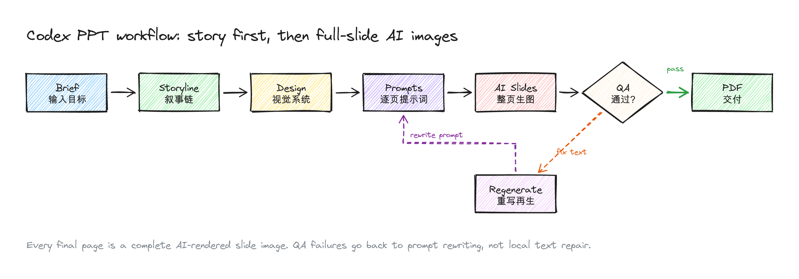
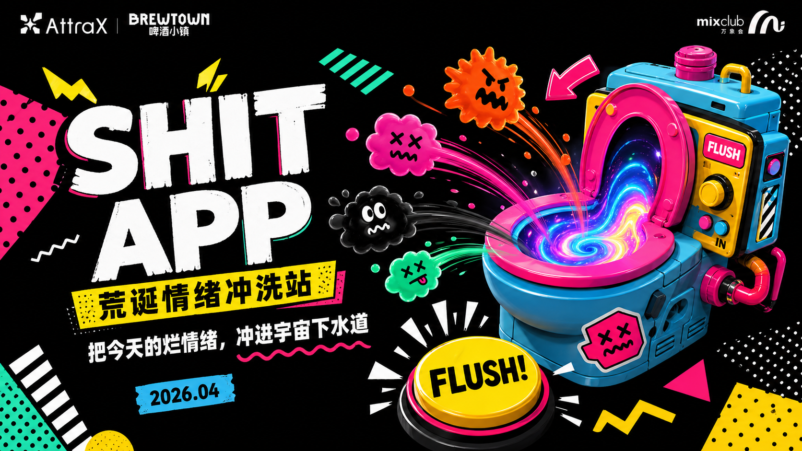
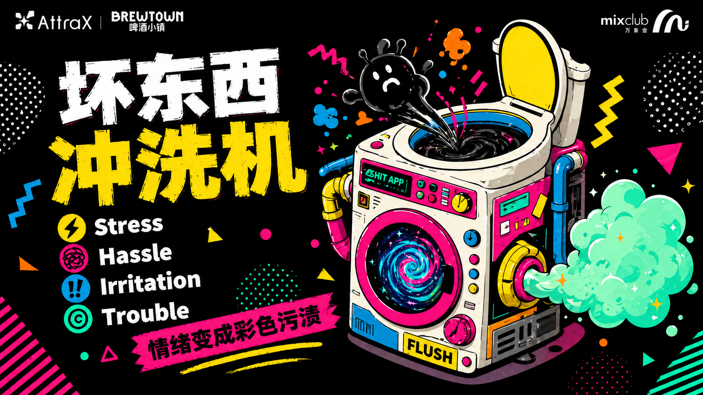

<p align="center">
  
</p>

<p align="center">
  <a href="./README.md">English</a> · <strong>简体中文</strong>
</p>

# Codex PPT

**Codex PPT** 是一个用于生成精美 16:9 演示文稿的 Codex Skill。它现在支持两种模式：默认的图片模式，以及先生成整页图片、再逐页重建成可编辑 PowerPoint 的 editable PPTX 模式。

它适合那种“不能只是生成几页模板”的场景：你需要先讲清故事、锁定视觉系统、写好逐页提示词、跑 QA，再交付一套可以拿去讲的 deck。Codex PPT 会让 Codex 像一个小型 PPT 制片人一样工作：先规划，再定风格，再整页生成，再挑刺返工；如果需要可编辑版本，再把每页交给独立重建流程转成可编辑文字框和可移动视觉层。

## 今日更新（2026-06-01）

- 新增 `editable-pptx` 模式：先生成整页图片，再逐页重建为可编辑 PowerPoint。
- 保留默认 `image` 模式：仍然可以只生成图片，并按需打包成 PDF。
- 新增每页 Sub Agent 重建约定：每张图单独产出 visual layers、`text-layer.json` 和 QA 记录。
- 新增可编辑 PPTX builder 与合并脚本，把逐页结果合成为最终 `.pptx`。

## 它能做什么

- 把选题、提纲、报告或粗糙笔记变成完整的 PPT 生成计划。
- 自动写出 brief、storyline、design system、storyboard 和逐页 prompt。
- 把每一页最终幻灯片生成为一张完整 AI 图片，包括版式、文字、图表和视觉主体。
- 在交付前强制 QA：比例、可读性、页序、风格一致性、文字准确性。
- 把通过 QA 的页面图编译成严格 16:9 的 PDF。
- 在 editable PPTX 模式下，为每页启动独立重建流程，合并成最终可编辑 `.pptx`。

## 输出模式

- `image`：默认模式。生成完整页面图；除非用户只要图片文件，否则会继续编译成 PDF。
- `editable-pptx`：先完成 `image` 模式的图片生成和 QA，再把每一页单独重建为 PowerPoint 可编辑文本和可移动图片层，最后导出 `.pptx`。

## 工作流

<p align="center">
  
</p>

核心原则很简单：**图片模式里，如果某一页没有通过 QA，就重写 prompt 并重新生成整页。不要在本地修补文字或版式。** 可编辑模式只在图片通过 QA 后启动，且会把派生文件放在 `editable/` 下。

## 安装

把仓库克隆到 Codex skills 目录：

```bash
git clone https://github.com/qybaihe/codex-ppt.git ~/.codex/skills/codex-ppt
```

然后对 Codex 说：

```text
Use $codex-ppt to make a 10-page product pitch deck about my app idea.
```

本地脚本依赖：

```bash
pip install -r ~/.codex/skills/codex-ppt/requirements.txt
npm install --prefix ~/.codex/skills/codex-ppt
```

如果想要可编辑 PPT：

```text
Use $codex-ppt to make an editable PPTX deck about my app idea.
```

## 示例效果

仓库里包含一套真实生成过的示例 deck：

- [最终 PDF](./examples/shit-app-memphis-pitch/final/shit-app-memphis-pitch.pdf)
- [最终 PPTX](./examples/shit-app-memphis-pitch/final/shit-app-memphis-pitch.pptx)
- [规划源文件](./examples/shit-app-memphis-pitch/source/)

### 部分页面






## 仓库结构

```text
.
├── SKILL.md
├── agents/openai.yaml
├── references/slide-quality-checklist.md
├── references/editable-pptx-mode.md
├── references/editable-slide-subagent-prompt.md
├── scripts/compile_slide_images_to_pdf.py
├── scripts/build_editable_ppt_from_layers.mjs
├── scripts/merge_editable_slide_outputs.py
├── assets/
└── examples/shit-app-memphis-pitch/
```

## Skill 的思路

Codex PPT 会把 PPT 生产拆成几个阶段：

1. **Brief**：定义受众、目标、页数、语气、素材来源和约束。
2. **Storyline**：先写叙事链，再开始设计页面。
3. **Design system**：锁定配色、字号层级、网格、页面变体、图像语言和反模式。
4. **Storyboard**：明确每一页的角色、标题、主结论、文案计划、版式、视觉内容和 QA 风险。
5. **Generation**：为每一页写 prompt，并生成完整页面图。
6. **QA**：拒绝错字、风格漂移、拥挤构图、裁切内容和弱封面/弱结尾。
7. **Export**：把通过检查的页面图编译成 16:9 PDF，或进入 editable PPTX 重建流程。

## 为什么是图片型 PPT？

很多 AI PPT 方案会失败，是因为它们把通用模板、本地叠字和风格不一致的图形拼在一起。Codex PPT 反过来：每一页都先被当作一张完整的视觉海报来生成。

这让它特别适合产品提案、概念 deck、发布材料、视觉报告、创意方案和风格强烈的项目叙事。需要后续改字、换图或调版时，可以选择 editable PPTX 模式，把最终图片 deck 再转成可编辑 PowerPoint。

## License

MIT
