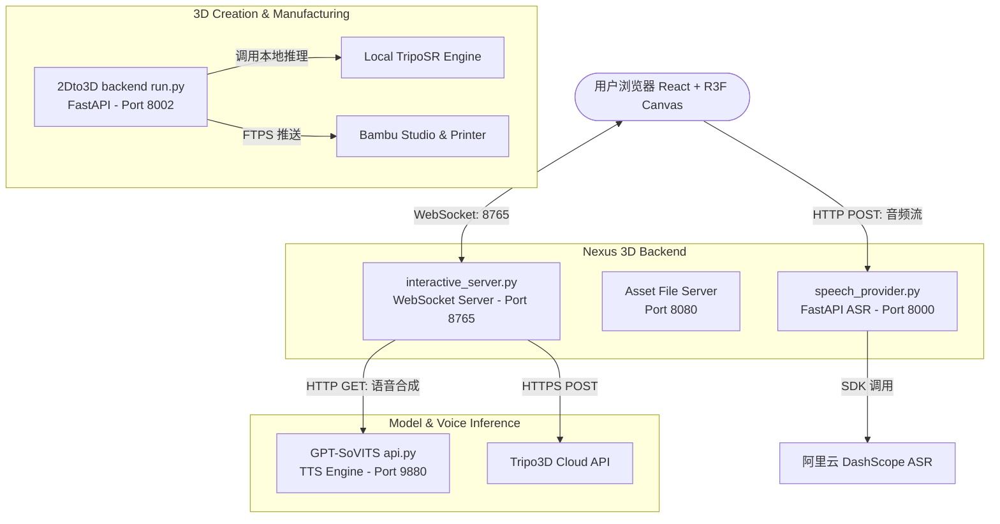

# 🌟 Nexus 3D: AI 沙盒创世数字人与 3D 生成控制系统

**Nexus 3D** 是一个强大的端到端（End-to-End）全自动化工作流平台。只需一句提示词或一段语音，即可实现从 AI 原画设计、3D 模型生成、格式转换、Unity 自动装配，到操控虚拟数字人进行实时智能对话与动作控制的完整体验。同时，项目集成了离线 **2D 转 3D 模型生成与打印管线 (2Dto3D)**，支持将生成的模型一键推送到 Bambu Lab 打印机进行实体物理制造。

---

## 🏗️ 系统架构与服务模块

本项目由以下三个核心模块整合而成：

1. **Nexus 3D 互动沙盒 (`backend2` & `frontend2`)**
   - **前端 Canvas**：基于 React 18 + Vite，利用 Three.js (React Three Fiber) 与 React Three Cannon 物理引擎构建 3D 虚拟场景，实现物理碰撞（如踢箱子）与动作展示。
   - **AI 交互后台 (`interactive_server.py`)**：使用 DeepSeek V4 Pro 大脑理解用户的空间操作指令并解析意图，控制数字人执行动作或聊天；整合 Tripo3D API 与 Pollinations AI 动态生成 Avatar 与全景场景。
   - **语音识别服务 (`speech_provider.py`)**：基于阿里云 DashScope `paraformer-realtime-v1` 模型提供低延迟的实时语音转文字 (ASR) 服务。
2. **2D 转 3D 转换管线 (`2Dto3D`)**
   - **核心网格生成器**：支持本地占位渲染或离线本地 **TripoSR** 推理引擎，将普通图片、SVG 或 PDF 文档快速转换为 OBJ 几何体或 3MF 打印模型。
   - **3D 打印集成 (`bambu_tool.py`)**：检测本地安装的 Bambu Studio 路径，通过 FTPS 协议自动将切片后的 G-Code 模型文件上传至局域网内的拓竹 3D 打印机，打通“虚拟到物理”的最后一公里。
3. **语音克隆合成引擎 (`GPT-SoVITS`)**
   - **本地 TTS**：集成 GPT-SoVITS 开源模型，通过 Few-shot 少样本学习克隆特定数字人声音，生成高质量的语音播报并返回给前端播放。

### 📡 通信拓扑与端口分配



| 服务名称 | 默认端口 | 协议 | 说明 |
|---|---|---|---|
| **Vite Frontend** | `5173` | HTTP | 网页 3D 交互主界面 |
| **ASR Provider** | `8000` | HTTP | 阿里云实时语音识别服务 |
| **2Dto3D Backend** | `8002` | HTTP | 2D图片转3D模型与打印的后端 (已配置避开 8000 端口) |
| **Asset Server** | `8080` | HTTP | 临时 3D 模型与背景图静态资源托管 |
| **WebSocket Server** | `8765` | WS | AI 大脑核心消息分发与动作操控中枢 |
| **GPT-SoVITS TTS** | `9880` | HTTP | 本地语音合成与克隆接口 |

---

## ✨ 核心功能特性

| 类别 | 功能 | 说明 |
|---|---|---|
| 🧠 **AI 大脑** | **DeepSeek V4 Pro** | 智能理解用户自然语言，判断动作意图，支持并发操作指令分配。 |
| 🎙️ **语音识别** | **阿里云 ASR** | 实时麦克风收音，支持中文拼音和环境噪声过滤。 |
| 🔊 **语音合成** | **GPT-SoVITS** | 本地语音合成克隆，支持通过简短的参考音频，让数字人开口说话。 |
| 🏃 **动作与物理** | **Cannon 物理碰撞** | 包含行走、跳舞、挥手等动画，支持实时控制物体与物理箱子碰撞交互。 |
| 🖼️ **场景自适应** | **AI 图像渲染** | 一句话生成 360° 全景背景并自动拉伸为天空盒或背景墙。 |
| 🤖 **3D 模型生成** | **2D 转 3D 云端+本地** | 接入 Tripo3D API 生成带骨骼 GLB 模型；接入本地 TripoSR 生成离线 OBJ 网格。 |
| 🖨️ **3D 打印** | **拓竹打印机直连** | 自动完成模型底部贴平（Z=0），居中摆盘，支持生成 3MF，一键唤醒 Bambu Studio。 |

---

## 🚀 快速开始

### 1. 环境准备 (Prerequisites)

* **Python 3.10+** (推荐 3.10 或 3.11 用于支持 PyTorch 推理)
* **Node.js 18+**
* **FFmpeg** (确保已添加到系统环境变量 `PATH`，用于音频采样率转换与压缩)
* **API 密钥配置**：
  * `DEEPSEEK_API_KEY`: 大语言模型密钥（在 `backend2/interactive_server.py` 中配置）
  * `DASHSCOPE_API_KEY`: 阿里云智能语音交互密钥（在 `backend2/speech_provider.py` 中配置）
  * `TRIPO_API_KEY`: Tripo3D 密钥，用于生成带 Mixamo 骨骼动画 of 3D 数字人（在环境变量中配置）

---

### 2. 快捷一键启动 (推荐)

项目根目录下提供了一键启动脚本与批处理文件，能够自动检测端口状态，并在独立的窗口中并发拉起所有依赖服务：

* **Windows 双击启动 (最简便)**：
  在 Windows 资源管理器中，直接双击项目根目录下的 **`start.bat`** 即可。该批处理会自动绕过 PowerShell 脚本执行策略限制，直接打开交互菜单。
  
* **PowerShell 命令行启动**：
  打开 PowerShell 并运行以下命令：
  ```powershell
  .\start_project.ps1
  ```

该脚本提供以下选项：
- **选项 1**：一键启动完整 Nexus 3D 互动系统（包括 ASR 后台、WS 控制后台和 Vite 前端）
- **选项 2**：仅启动 2Dto3D 离线模型转换与打印管理后台（默认端口 8002）
- **选项 3**：启动 GPT-SoVITS 推理 API 接口（支持手动指定参考音频 `-dr` 及参考文本 `-dt`）
- **选项 4**：并发拉起上述**所有 5 个终端服务**
- **选项 5**：退出脚本


---

### 3. 手动逐项启动 (Manual Launch)

如果需要调试或不便运行脚本，可按如下步骤手动在不同终端中拉起服务：

#### 终端 1：启动语音识别后台 (ASR)
```bash
cd backend2
pip install -r requirements.txt
python speech_provider.py
```
> 服务运行在 `http://127.0.0.1:8000`

#### 终端 2：启动 WebSocket 交互后台与静态文件服务器
```bash
cd backend2
python interactive_server.py
```
> 核心控制中枢运行在 `ws://127.0.0.1:8765`，静态模型托管在 `http://127.0.0.1:8080`

#### 终端 3：启动语音合成后台 (GPT-SoVITS TTS)
```bash
cd GPT-SoVITS
# 使用特定的参考音频作为声音模板启动
python api.py -dr "ref_audio_path.wav" -dt "参考音频的文字内容" -dl zh
```
> 服务运行在 `http://127.0.0.1:9880`

#### 终端 4：启动 2Dto3D 几何转换后台
```bash
cd 2Dto3D
pip install -r backend/requirements.txt
python backend/run.py
```
> 服务运行在 `http://127.0.0.1:8002`

#### 终端 5：启动 Vite 前端交互 Canvas
```bash
cd frontend2
npm install
npm run dev
```
> 打开浏览器访问 `http://localhost:5173`。在界面中开启麦克风权限后，即可和 3D 场景中的数字人进行交互。

---

## 🎮 场景交互与使用指南

### 1. 空间控制与数字人行为 (Web3D Scene)
在左侧面板或点击右下角麦克风说出以下指令：

* **运动指令**：`"1号数字人向左移五步"`，`"跳一下"`，`"跳个舞"`。
* **物理推碰**：`"去撞前面那个橙色的木箱"`（数字人会自动寻路走到目标物体坐标，触发 Cannon 物理碰撞）。
* **AI 创世**：
  * `"在场景中生成一个穿着西装的机器人"`（后台自动请求 Tripo3D 并在云端完成 Mixamo 标准骨骼装配，下载为 GLB 并动态注入 3D 舞台）。
  * `"生成一个赛步朋克科幻风格的天空场景"`（后台自动绘制 360° 天空背景并无缝加载进 R3F Canvas）。
* **独立对话模式**：每个数字人的独立卡片中可以点击切换：
  * **💬 回答模式**：聊天对话，数字人会调用 DeepSeek 分析，并通过 GPT-SoVITS 播放合成好的克隆声音。
  * **做动作模式**：文本框输入转换为 3D 移动和动画。

### 2. 2D 转 3D 与 Bambu 3D 打印调试 (2Dto3D Debugger)
访问 2Dto3D 控制台界面（如果是通过 `start_project.ps1` 启动，可选择进入或直接访问调试页）：
1. 上传一张透明通道图或 PDF/SVG 文档。
2. 设定参数 profile 为 `print`（打印机优化，修复为闭合的流行网格网）或 `render`（优化材质与 UV 保存）。
3. 转换完成后可以预览生成的 3D 网格。
4. 点击 **Open Bambu Studio**，后台会自动将生成的 3MF 文件导入拓竹切片软件；如配置了 IP 与 Access Code，则可通过 FTPS 直接上传至物理打印机。

---

## 📁 目录结构

```text
Nexus-3D-AI-Agent/
├── start_project.ps1           # 核心：项目一键多终端并发启动与端口检测脚本
├── backend2/
│   ├── interactive_server.py   # AI 大脑 WebSocket 中枢 + 静态资产 HTTP 服务
│   ├── speech_provider.py      # DashScope ASR 实时语音转文字接口
│   ├── agent_tools.py          # 3D 资产生成工具 (Tripo3D 云端 API 连带自动骨骼绑定)
│   ├── image_generator.py      # AI 图像生成工具 (Pollinations AI)
│   ├── bambu_tool.py           # Bambu Lab 物理打印机 FTP 发送工具
│   └── main.py                 # 6步全自动化离线生成 CLI 管线
├── frontend2/
│   ├── src/
│   │   ├── App.jsx             # React 交互页面，含控制面板、WebSocket 广播处理
│   │   ├── components/
│   │   │   └── Web3DScene.jsx  # R3F 三维物理场景组件 (含 Canvas, 物理引擎, 数字人模型渲染)
│   │   └── index.css           # 全局样式文件
│   └── package.json
├── 2Dto3D/                     # 2D 转 3D 网格处理与打印集成模块
│   ├── backend/
│   │   ├── run.py              # FastAPI 启动入口 (Port 8002)
│   │   └── app/
│   │       ├── main.py         # 核心 API 定义
│   │       └── core/
│   │           ├── generator.py # 模型生成处理 (本地占位网格/离线 TripoSR 运行器)
│   │           └── bambu.py    # 拓竹客户端连接模块
│   ├── frontend/
│   │   └── index.html          # 2Dto3D 最简调试 UI 页面
│   └── start_server.ps1        # 2Dto3D 专属启动脚本
└── GPT-SoVITS/                 # 离线少样本 TTS 语音合成与声音克隆引擎
    ├── api.py                  # TTS API V1 接口服务 (Port 9880, 支持 / 端点)
    ├── api_v2.py               # TTS API V2 接口服务 (Port 9880, 支持 /tts 端点)
    └── webui.py                # 声音训练及推理的可视化 WebUI
```

---

## 🛠️ 技术栈清单

- **前端 canvas**：React 18 + Vite + Three.js + React Three Fiber + Drei + React Three Cannon 物理模拟
- **后端框架**：Python + FastAPI + websockets + Uvicorn
- **AI 能力**：DeepSeek V4 Pro + 阿里云 DashScope Paraformer + GPT-SoVITS TTS 本地克隆
- **3D 引擎与转换**：Blender Headless CLI (格式转换) + Tripo3D API (带绑骨 3D 生成) + TripoSR (离线轻量 3D 重建) + Trimesh
- **制造端连接**：Bambu Studio Console API + FTPS 协议

---

## ⚠️ 注意事项

- **端口冲突**：由于 ASR 语音识别服务占用 `8000` 端口，`2Dto3D` 后端默认端口已被修改为 `8002`。如果手动启动，请不要将两者绑定到同一个端口。
- **混合精度/硬件要求**：运行 `GPT-SoVITS` 和 `2Dto3D` 的本地推理模型时，建议配备 8GB 以上显存的英伟达显卡，并安装相应的 CUDA 工具链与 PyTorch 环境。
- **麦克风授权**：首次在浏览器打开 `http://localhost:5173` 时，请在地址栏左侧弹出的权限对话框中选择“允许使用麦克风”，否则无法使用实时语音互动功能。

---

## 📄 开源协议

MIT License
