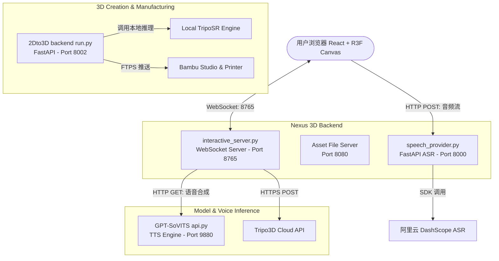

注意： 由于仓库存储有限，我把可运行完整代码放这里了，包括用来训练的语料库：
我用夸克网盘给你分享了「pythonProject」，点击链接或复制整段内容，打开「夸克APP」即可获取。
/~4d803A7vfi~:/
链接：https://pan.quark.cn/s/3a4d5abf311a?pwd=zXHN
提取码：zXHN


# 智能问答系统

基于 Flask 的多功能智能问答平台，集成电影问答、通用问答机器人、语音助手和讨论区等功能。

## 功能特性

- 🎬 **电影问答**: 基于知识库的检索式电影问答系统
- 🤖 **问答机器人**: 基于 Neo4j 知识图谱的通用问答系统
- 💬 **讨论区**: 用户问答讨论和评论功能
- 🔊 **语音功能**: 支持文本转语音（TTS），多发音人选择
- 👥 **用户管理**: 完整的用户认证、权限管理和历史记录
- 🔐 **管理员后台**: 用户管理、内容审核等功能

## 环境要求

- Python 3.7+
- MySQL 5.7+ 或 MySQL 8.0+
- Neo4j 4.0+（可选，用于通用问答机器人）
- 百度 TTS API（用于语音功能）

## 安装步骤

### 1. 克隆项目

```bash
git clone <repository-url>
cd pythonProject
```

### 2. 创建虚拟环境（推荐）

你可以选择以下两种方式之一来创建并激活虚拟环境：

#### 方式一：使用 Conda 创建（建议指定 Python 3.9 版本以确保 py2neo 和 pandas 兼容性）
```bash
# 创建虚拟环境
conda create --prefix "C:\Users\Asus\Desktop\demo-repository\demo-repository\.venv" python=3.9

# Windows 激活虚拟环境
conda activate "C:\Users\Asus\Desktop\demo-repository\demo-repository\.venv"
```

#### 方式二：使用 Python 自带的 venv（极速创建）
```bash
# 创建虚拟环境
python -m venv "C:\Users\Asus\Desktop\demo-repository\demo-repository\.venv"

# Windows 激活虚拟环境 (PowerShell)
& "C:\Users\Asus\Desktop\demo-repository\demo-repository\.venv\Scripts\Activate.ps1"

# Windows 激活虚拟环境 (CMD)
"C:\Users\Asus\Desktop\demo-repository\demo-repository\.venv\Scripts\activate"
```

### 3. 安装依赖

```bash
pip install -r requirements.txt
```
数据库下载地址：https://neo4j.com/
下载方法参考： https://blog.csdn.net/weixin_66401877/article/details/153195602
数据库下载需要科学上网。
运行前要配置外部 API，配置方法如下：

#### 1) 配置百度语音 API
参考方法：https://blog.csdn.net/Exaggeration08/article/details/105610925
在 `voice_assistant/tts.py` 中配置相应的 `API_KEY` 和 `SECRET_KEY`。

#### 2) 配置百度翻译 API
在 `voice_assistant/translator.py` 中配置 `APP_ID`、`SECRET_KEY` 和 `TRANSLATE_URL`。

#### 3) 配置 DeepSeek API Key
在后台系统中使用 DeepSeek 回答引擎时，需要配置 DeepSeek 官方 API Key：
* **Secret Key / API Key**: `<YOUR_DEEPSEEK_API_KEY>` (例如从 DeepSeek 开放平台申请的 `sk-...` 格式的 Key)
可以在系统环境变量中增加 `DEEPSEEK_API_KEY`，或者在系统启动的环境配置中填入该 Key。


### 4. 配置数据库

#### MySQL 配置

编辑 `start/config.py`，修改数据库连接信息：

```python
MYSQL_CONFIG = {
    'host': 'localhost',
    'port': 3306,
    'user': 'root',
    'password': 'your_password',
    'database': 'voice_assistant_db',
    'charset': 'utf8mb4'
}
```

创建数据库：

```sql
CREATE DATABASE voice_assistant_db CHARACTER SET utf8mb4 COLLATE utf8mb4_unicode_ci;
```

#### Neo4j 配置（可选）

如果使用通用问答机器人，需要配置 Neo4j：

1. 安装并启动 Neo4j 服务
2. 默认连接：`http://localhost:7474`
3. 用户名：`neo4j`
4. 密码：在 `ask_answer_robot/retrieval_engine.py` 中配置

### 5. 初始化数据库

首次运行会自动创建数据库表。默认管理员账号：
- 用户名：`daministrator`
- 密码：`123456`

## 启动方法

### 方式一：使用主启动文件（推荐）

```bash
python main.py
```

### 方式二：直接启动

```bash
cd start
python app.py
```

启动成功后访问：
- 主页面：http://localhost:5001
- 管理员后台：http://localhost:5001/admin

## 项目架构

### 目录结构

```
pythonProject/
├── main.py                 # 主启动文件
├── start/                  # 主应用目录
│   ├── app.py             # Flask 主应用
│   ├── database.py        # 数据库操作模块
│   ├── config.py          # 配置文件
│   ├── templates/         # HTML 模板
│   └── static/           # 静态资源（CSS、JS）
├── movieanswer/           # 电影问答模块
│   └── Movie-KBQA/       # 电影知识库问答
│       └── src/          # 检索服务源码
├── ask_answer_robot/     # 通用问答机器人模块
│   ├── retrieval_engine.py  # 检索引擎
│   ├── qa_service.py     # 问答服务
│   └── data_importer.py  # 数据导入工具
├── voice_assistant/      # 语音助手模块
│   ├── tts.py           # 文本转语音
│   ├── asr.py           # 语音识别
│   └── translator.py    # 翻译服务
└── text_similarity/     # 文本相似度算法模块
    ├── bm25.py
    ├── jaccard.py
    └── edit_distance.py
```

### 核心模块

1. **主应用层** (`start/app.py`)
   - Flask Web 应用
   - 路由管理
   - 用户认证与授权
   - API 接口

2. **数据层** (`start/database.py`)
   - MySQL 数据库操作
   - 用户管理
   - 历史记录存储
   - 讨论区数据管理

3. **问答模块**
   - **电影问答** (`movieanswer/`): 基于知识库的检索式问答
   - **通用问答** (`ask_answer_robot/`): 基于 Neo4j 的问答机器人

4. **算法模块** (`text_similarity/`)
   - BM25 检索
   - Jaccard 相似度
   - 编辑距离
   - TF-IDF

5. **服务模块** (`voice_assistant/`)
   - 语音合成（TTS）
   - 语音识别（ASR）
   - 文本翻译

### 技术栈

#### 后端技术

- **Web框架**: Flask 3.0.0
- **编程语言**: Python 3.7+
- **数据库驱动**:
  - PyMySQL - MySQL数据库连接
  - Py2neo 2021.2.3 - Neo4j图数据库连接
- **数据处理**:
  - Pandas 2.0.3 - 数据分析和处理
  - NumPy >=1.20.0 - 数值计算
- **中文处理**:
  - Jieba 0.42.1 - 中文分词
- **其他库**:
  - Werkzeug - Flask依赖，文件上传处理
  - Hashlib - 密码加密（MD5/SHA）
  - Threading - 多线程异步数据加载
  - JSON - 数据序列化

#### 前端技术

- **HTML5**: 页面结构
- **CSS3**: 
  - 内联样式和样式表
  - Flexbox布局
  - 渐变背景、动画效果
  - 响应式设计
- **JavaScript (ES6+)**:
  - 原生JavaScript（无框架依赖）
  - Fetch API - 异步HTTP请求
  - DOM操作
  - 事件处理
  - 音频播放控制（HTML5 Audio API）
  - 动态内容渲染

#### 数据库

- **MySQL 5.7+/8.0+**:
  - 用户认证和权限管理
  - 问答历史记录存储
  - 讨论区数据存储
  - 评论数据存储
  - TTS音频缓存
- **Neo4j 4.0+**:
  - 知识图谱存储
  - 问答对关系存储
  - 图数据库查询（Cypher查询语言）

#### 核心算法与技术点

- **文本相似度算法**:
  - **BM25**: 信息检索排序算法，用于计算查询与文档的相关性
  - **Jaccard相似度**: 基于集合交并比的相似度计算
  - **编辑距离 (Edit Distance)**: 字符串相似度计算（Levenshtein距离）
  - **TF-IDF**: 词频-逆文档频率，用于关键词提取和文本相似度
  - **最长公共子序列 (LCS)**: 文本相似度计算
  - **N-gram模型**: 文本特征提取

- **检索优化技术**:
  - **倒排索引 (Inverted Index)**: 快速候选问题检索
  - **候选过滤**: 基于关键词的预筛选，减少计算量
  - **多算法融合**: BM25、Jaccard、编辑距离加权组合
  - **相似度阈值过滤**: 低于阈值的结果不返回

- **中文处理技术**:
  - **中文分词**: 使用Jieba进行中文文本分词
  - **关键词提取**: 从问题中提取关键信息
  - **文本归一化**: 去除标点、空格等

- **性能优化**:
  - **异步数据加载**: 使用多线程后台加载大量数据
  - **数据缓存**: TTS音频缓存，避免重复生成
  - **索引优化**: 数据库索引优化查询速度
  - **分批加载**: 初始加载部分数据，剩余数据异步加载

#### 第三方服务集成

- **百度TTS API**:
  - 文本转语音服务
  - 支持4种中文发音人（度小美、度小字、度逍遥、度丫丫）
  - 音频格式：MP3
  - 语音缓存机制

- **百度翻译API** (已集成但未启用):
  - 中英文翻译功能
  - 需要配置APP_ID、SECRET_KEY、TRANSLATE_URL

#### 系统架构特点

- **模块化设计**: 各功能模块独立，便于维护和扩展
- **RESTful API**: 前后端分离，API接口标准化
- **Session管理**: Flask Session实现用户状态管理
- **权限控制**: 基于角色的访问控制（RBAC）
- **错误处理**: 完善的异常捕获和错误提示
- **快速问答匹配**: 预设问答对直接匹配，无需检索

## 主要功能模块

### 1. 电影问答

- 基于知识库的检索式问答
- 支持电影评分、演员信息、上映时间等查询
- 快速问答对直接匹配（9个预设问题）

### 2. 通用问答机器人

- 基于 Neo4j 知识图谱
- 支持多种文本相似度算法（BM25、Jaccard、编辑距离）
- 快速问答对直接匹配（10个预设问题）
- 异步数据加载，支持大数据集

### 3. 讨论区

- 用户发布问题和讨论
- 支持评论和回复
- 管理员审核和管理

### 4. 语音功能

- 文本转语音（TTS）
- 支持4种中文发音人选择
- 语音缓存机制

### 5. 用户管理

- 用户注册和登录
- 角色管理（普通用户、管理员）
- 历史记录查询和删除
- 管理员后台管理

## API 接口

### 用户认证

- `POST /api/register` - 用户注册
- `POST /api/login` - 用户登录
- `GET /api/logout` - 退出登录
- `GET /api/user_info` - 获取用户信息

### 电影问答

- `POST /api/movie/ask` - 提交问题
- `POST /api/movie/search` - 搜索相关问题
- `GET /api/movie/history` - 获取历史记录
- `POST /api/movie/history/delete` - 删除历史记录
- `GET /api/movie/stats` - 获取统计信息

### 问答机器人

- `POST /api/qa_robot/ask` - 提交问题
- `POST /api/qa_robot/search` - 搜索相关问题
- `GET /api/qa_robot/history` - 获取历史记录
- `POST /api/qa_robot/history/delete` - 删除历史记录
- `GET /api/qa_robot/stats` - 获取统计信息

### 讨论区

- `POST /api/qa_discussion/submit` - 提交讨论
- `GET /api/qa_discussion/list` - 获取讨论列表
- `GET /api/qa_discussion/<id>` - 获取讨论详情
- `POST /api/qa_discussion/<id>/comment` - 添加评论
- `DELETE /api/qa_discussion/<id>` - 删除讨论（管理员）

### 语音服务

- `POST /api/voice/tts` - 文本转语音

### 管理员接口

- `GET /api/admin/users` - 获取用户列表
- `POST /api/admin/users` - 创建用户
- `PUT /api/admin/user/<id>/role` - 更新用户角色
- `DELETE /api/admin/user/<id>` - 删除用户

## 🌟 Nexus 3D: AI 沙盒创世数字人与 3D 生成控制系统

除了经典的 Flask 智能问答与 3D 数字人基础版，本项目还集成了完整的 **Nexus 3D** 端到端（End-to-End）全自动化工作流平台。只需一句提示词或一段语音，即可实现从 AI 原画设计、3D 模型生成、格式转换、Unity 自动装配，到操控虚拟数字人进行实时智能对话与动作控制的完整体验。同时，项目集成了离线 **2D 转 3D 模型生成与打印管线 (2Dto3D)**，支持将生成的模型一键推送到 Bambu Lab 打印机进行实体物理制造。

### 🏗️ 系统架构与服务模块

本项目由以下三个核心模块整合而成：

1. **Nexus 3D 互动沙盒 (`backend2` & `frontend2`)**
   - **前端 Canvas**：基于 React 18 + Vite，利用 Three.js (React Three Fiber) 与 React Three Cannon 物理引擎构建 3D 虚拟场景，实现物理碰撞（如踢箱子）与动作展示。
   - **AI 交互后台 (`interactive_server.py`)**：使用 DeepSeek V4 Pro 大脑理解用户的空间操作指令并解析意图，控制数字人执行动作或聊天；整合 Tripo3D API 与 Pollinations AI 动态生成 Avatar 与全景场景。
   - **语音识别服务 (`speech_provider.py`)**：基于阿里云 DashScope `paraformer-realtime-v1` 模型提供低延迟的实时语音转文字 (ASR) 服务。
2. **2D 转 3D 转换管线 (`2Dto3D`)**
   - **核心网格生成器**：支持本地占位渲染或离线本地 **TripoSR** 推理引擎，将普通图片、SVG 或 PDF 文档快速转换为 OBJ 几何体或 3MF 打印模型。
   - **3D 打印集成 (`bambu_tool.py`)**：检测本地安装的 Bambu Studio 路径，通过 FTPS 协议自动将切片后的 G-Code 模型文件上传至局域网内的拓竹 3D 打印机，打通“虚拟到物理”的最后一公里。
3. **语音克隆合成引擎 (`GPT-SoVITS`)**
   - **本地 TTS**：集成 GPT-SoVITS 开源模型，通过 Few-shot 少样本学习克隆特定数字人声音，生成高质量的语音播报并返回给前端播放。

#### 📡 通信拓扑与端口分配



| 服务名称 | 默认端口 | 协议 | 说明 |
|---|---|---|---|
| **Vite Frontend** | `5173` | HTTP | 网页 3D 交互主界面 |
| **ASR Provider** | `8000` | HTTP | 阿里云实时语音识别服务 |
| **2Dto3D Backend** | `8002` | HTTP | 2D图片转3D模型与打印的后端 (已配置避开 8000 端口) |
| **Asset Server** | `8080` | HTTP | 临时 3D 模型与背景图静态资源托管 |
| **WebSocket Server** | `8765` | WS | AI 大脑核心消息分发与动作操控中枢 |
| **GPT-SoVITS TTS** | `9880` | HTTP | 本地语音合成与克隆接口 |

---

### ✨ 核心功能特性

| 类别 | 功能 | 说明 |
|---|---|---|
| 🧠 **AI 大脑** | **DeepSeek V4 Pro** | 智能理解用户自然语言，判断动作意图，支持并发操作指令分配。 |
| 🎙️ **语音识别** | **阿里云 ASR** | 实时麦克风收音，支持中文拼音和环境噪声过滤。 |
| 🔊 **语音合成** | **GPT-SoVITS** | 本地语音合成克隆，支持通过简短的参考音频，让数字人开口说话。 |
| 🏃 **动作与物理** | **Cannon 物理碰撞** | 包含行走、跳舞、挥手等动画，支持实时控制物体与物理箱子碰撞交互。 |
| 🖼️ **场景自适应** | **AI 图像渲染** | 一句话生成 360° 全景背景并自动拉伸为天空盒或背景墙。 |
| 🤖 **3D 模型生成** | **2D 转 3D 云端+本地** | 接入 Tripo3D API 生成带骨骼 GLB 模型；接入本地 TripoSR 生成离线 OBJ 网格。 |
| 🖨️ **3D 打印** | **拓竹打印机直连** | 自动完成模型底部贴平（Z=0），居中摆盘，支持生成 3MF，一键唤醒 Bambu Studio。 |

---

### 🚀 快速开始

#### 1) 环境准备 (Prerequisites)

* **Python 3.10+** (推荐 3.10 或 3.11 用于支持 PyTorch 推理)
* **Node.js 18+**
* **FFmpeg** (确保已添加到系统环境变量 `PATH`，用于音频采样率转换与压缩)
* **API 密钥配置**：
  * `DEEPSEEK_API_KEY`: 大语言模型密钥（在 `backend2/interactive_server.py` 中配置）
  * `DASHSCOPE_API_KEY`: 阿里云智能语音交互密钥（在 `backend2/speech_provider.py` 中配置）
  * `TRIPO_API_KEY`: Tripo3D 密钥，用于生成带 Mixamo 骨骼动画 of 3D 数字人（在环境变量中配置）

#### 2) 快捷一键启动 (推荐)

项目根目录下提供了一键启动脚本与批处理文件，能够自动检测端口状态，并在独立的窗口中并发拉起所有依赖服务：

* **Windows 双击启动 (最简便)**：
  在 Windows 资源管理器中，直接双击项目根目录下的 **`start.bat`** 即可。该批处理会自动绕过 PowerShell 脚本执行策略限制，直接打开交互菜单。
  
* **PowerShell 命令行启动**：
  打开 PowerShell 并运行以下命令：
  ```powershell
  .\start_project.ps1
  ```

该脚本提供以下选项：
- **选项 1**：一键启动完整 Nexus 3D 互动系统（包括 ASR 后台、WS 控制后台和 Vite 前端）
- **选项 2**：仅启动 2Dto3D 离线模型转换与打印管理后台（默认端口 8002）
- **选项 3**：启动 GPT-SoVITS 推理 API 接口（支持手动指定参考音频 `-dr` 及参考文本 `-dt`）
- **选项 4**：并发拉起上述**所有 5 个终端服务**
- **选项 5**：退出脚本

#### 3) 手动逐项启动 (Manual Launch)

如果需要调试或不便运行脚本，可按如下步骤手动在不同终端中拉起服务：

**终端 1：启动语音识别后台 (ASR)**
```bash
cd backend2
pip install -r requirements.txt
python speech_provider.py
```
> 服务运行在 `http://127.0.0.1:8000`

**终端 2：启动 WebSocket 交互后台与静态文件服务器**
```bash
cd backend2
python interactive_server.py
```
> 核心控制中枢运行在 `ws://127.0.0.1:8765`，静态模型托管在 `http://127.0.0.1:8080`

**终端 3：启动语音合成后台 (GPT-SoVITS TTS)**
```bash
cd GPT-SoVITS
# 使用特定的参考音频作为声音模板启动
python api.py -dr "ref_audio_path.wav" -dt "参考音频的文字内容" -dl zh
```
> 服务运行在 `http://127.0.0.1:9880`

**终端 4：启动 2Dto3D 几何转换后台**
```bash
cd 2Dto3D
pip install -r backend/requirements.txt
python backend/run.py
```
> 服务运行在 `http://127.0.0.1:8002`

**终端 5：启动 Vite 前端交互 Canvas**
```bash
cd frontend2
npm install
npm run dev
```
> 打开浏览器访问 `http://localhost:5173`。在界面中开启麦克风权限后，即可和 3D 场景中的数字人进行交互。

---

### 🎮 场景交互与使用指南

#### 1) 空间控制与数字人行为 (Web3D Scene)
在左侧面板或点击右下角麦克风说出以下指令：
* **运动指令**：`"1号数字人向左移五步"`，`"跳一下"`，`"跳个舞"`。
* **物理推碰**：`"去撞前面那个橙色的木箱"`（数字人会自动寻路走到目标物体坐标，触发 Cannon 物理碰撞）。
* **AI 创世**：
  * `"在场景中生成一个穿着西装的机器人"`（后台自动请求 Tripo3D 并在云端完成 Mixamo 标准骨骼装配，下载为 GLB 并动态注入 3D 舞台）。
  * `"生成一个赛步朋克科幻风格的天空场景"`（后台自动绘制 360° 天空背景并无缝加载进 R3F Canvas）。
* **独立对话模式**：每个数字人的独立卡片中可以点击切换：
  * **💬 回答模式**：聊天对话，数字人会调用 DeepSeek 分析，并通过 GPT-SoVITS 播放合成好的克隆声音。
  * **做动作模式**：文本框输入转换为 3D 移动和动画。

#### 2) 2D 转 3D 与 Bambu 3D 打印调试 (2Dto3D Debugger)
访问 2Dto3D 控制台界面（如果是通过 `start_project.ps1` 启动，可选择进入或直接访问调试页）：
1. 上传一张透明通道图或 PDF/SVG 文档。
2. 设定参数 profile 为 `print`（打印机优化，修复为闭合的流行网格网）或 `render`（优化材质与 UV 保存）。
3. 转换完成后可以预览生成的 3D 网格。
4. 点击 **Open Bambu Studio**，后台会自动将生成的 3MF 文件导入拓竹切片软件；如配置了 IP 与 Access Code，则可通过 FTPS 直接上传至物理打印机。

---

### 📁 目录结构与模块说明

```text
Nexus-3D-AI-Agent/
├── start_project.ps1           # 核心：项目一键多终端并发启动与端口检测脚本
├── backend2/
│   ├── interactive_server.py   # AI 大脑 WebSocket 中枢 + 静态资产 HTTP 服务
│   ├── speech_provider.py      # DashScope ASR 实时语音转文字接口
│   ├── agent_tools.py          # 3D 资产生成工具 (Tripo3D 云端 API 连带自动骨骼绑定)
│   ├── image_generator.py      # AI 图像生成工具 (Pollinations AI)
│   ├── bambu_tool.py           # Bambu Lab 物理打印机 FTP 发送工具
│   └── main.py                 # 6步全自动化离线生成 CLI 管线
├── frontend2/
│   ├── src/
│   │   ├── App.jsx             # React 交互页面，含控制面板、WebSocket 广播处理
│   │   ├── components/
│   │   │   └── Web3DScene.jsx  # R3F 三维物理场景组件 (含 Canvas, 物理引擎, 数字人模型渲染)
│   │   └── index.css           # 全局样式文件
│   └── package.json
├── 2Dto3D/                     # 2D 转 3D 网格处理与打印集成模块
│   ├── backend/
│   │   ├── run.py              # FastAPI 启动入口 (Port 8002)
│   │   └── app/
│   │       ├── main.py         # 核心 API 定义
│   │       └── core/
│   │           ├── generator.py # 模型生成处理 (本地占位网格/离线 TripoSR 运行器)
│   │           └── bambu.py    # 拓竹客户端连接模块
│   ├── frontend/
│   │   └── index.html          # 2Dto3D 最简调试 UI 页面
│   └── start_server.ps1        # 2Dto3D 专属启动脚本
└── GPT-SoVITS/                 # 离线少样本 TTS 语音合成与声音克隆引擎
    ├── api.py                  # TTS API V1 接口服务 (Port 9880, 支持 / 端点)
    ├── api_v2.py               # TTS API V2 接口服务 (Port 9880, 支持 /tts 端点)
    └── webui.py                # 声音训练及推理的可视化 WebUI
```

---

### ⚠️ 注意事项与系统要求

* **端口冲突**：由于 ASR 语音识别服务占用 `8000` 端口，`2Dto3D` 后端默认端口已被修改为 `8002`。如果手动启动，请不要将两者绑定到同一个端口。
* **混合精度/硬件要求**：运行 `GPT-SoVITS` 和 `2Dto3D` 的本地推理模型时，建议配备 8GB 以上显存的英伟达显卡，并安装相应的 CUDA 工具链与 PyTorch 环境。
* **麦克风授权**：首次在浏览器打开 `http://localhost:5173` 时，请在地址栏左侧弹出的权限对话框中选择“允许使用麦克风”，否则无法使用实时语音互动功能。

---

## 数据导入


### 通用问答机器人数据

1. 准备 CSV 语料库文件，放置在 `ask_answer_robot/语料库/` 目录
2. 运行数据导入脚本：

```bash
cd ask_answer_robot
python import_data.py
```

3. 导入快速问答对：

```bash
python import_quick_qa.py
```


## 配置说明

### 数据库配置

编辑 `start/config.py` 修改数据库连接信息。

### 应用密钥

修改 `start/config.py` 中的 `SECRET_KEY`，生产环境请使用强随机密钥。

### Neo4j 配置

编辑 `ask_answer_robot/retrieval_engine.py` 修改 Neo4j 连接信息。

### 语音服务配置

编辑 `voice_assistant/tts.py` 配置百度 TTS API 密钥。

## 注意事项

1. **数据库初始化**: 首次运行会自动创建数据库表，确保 MySQL 服务已启动
2. **Neo4j 服务**: 通用问答机器人需要 Neo4j 服务，如不使用可忽略相关错误
3. **数据加载**: 通用问答机器人首次启动会加载 20000 条数据，剩余数据在后台异步加载
4. **管理员账号**: 默认管理员账号为 `daministrator`，密码 `123456`，首次登录后建议修改
5. **端口占用**: 默认使用 5001 端口，如被占用请修改 `main.py` 或 `start/app.py` 中的端口配置

## 项目结构说明

- `main.py`: 主启动入口
- `start/`: 主应用代码
- `movieanswer/`: 电影问答模块
- `ask_answer_robot/`: 通用问答机器人模块
- `voice_assistant/`: 语音助手模块
- `text_similarity/`: 文本相似度算法库

## 开发说明

### 添加新的问答模块

1. 在对应目录创建服务类
2. 在 `start/app.py` 中导入并初始化
3. 添加路由和 API 接口
4. 创建前端模板

### 扩展快速问答对

编辑 `start/app.py` 中的 `QUICK_QA_MAP` 或 `MOVIE_QUICK_QA_MAP` 字典。

## 许可证

本项目仅供学习和研究使用。
