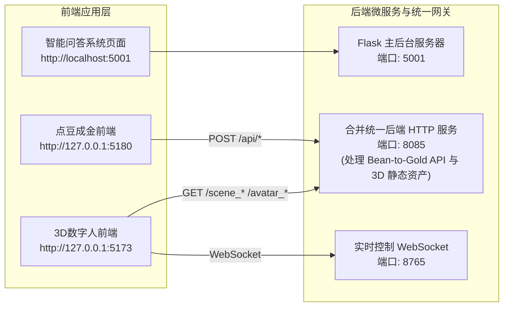

# 智能多元化互动空间：AI 问答平台 · 点豆成金 · Nexus 3D 数字人系统

欢迎使用 **智能多元化互动空间** 全栈整合系统。本项目是一套高度集成、响应式、模块间互相协作的现代多元化 AI 综合应用平台，结合了：
1. **智能问答系统 (Flask + Neo4j + MySQL)**：涵盖电影智能问答、通用知识图谱机器人、大纲单独生成框架、全屏系统管理及语音助理。
2. **点豆成金 (Bean-to-Gold Studio)**：结合 AI 创意生成与拼豆像素画编辑的多功能设计应用，支持无缝跳转至 3D 数字人工作流。
3. **Nexus 3D 数字人交互系统 (3D Digital Human Sandbox)**：基于 Three.js 3D 渲染与 WebSocket 交互，实现 3D 场景与数字模型的动作/语音双向互动。

---

## 🌟 核心系统特性

### 1. 智能问答系统 (AI Q&A Platform)
- **多领域智能问答**：集成电影问答、通用知识图谱问答（Neo4j）、深层语义相似度检索。
- **AI 独立大纲生成框架**：右侧独立专栏模块，自动提炼问答重点，生成清晰结构化大纲。
- **全屏系统设置视图**：宽屏自适应布局，直观展示系统状态、服务连通性与模型参数。
- **无刷新模块切换**：SPA 单页路由与后台多服务并发运行，切换不同模块互不干扰。

### 2. 点豆成金系统 (Bean-to-Gold Studio)
- **AI 图像到像素拼豆转化**：输入文字提示或上传图片，自动生成 16x16 / 32x32 / 64x64 等规格拼豆网格设计。
- **无缝衔接 3D 数字模型**：页面包含「3D数字模型」快捷按钮，点击直接开启立体可视化转换与 3D 数字人互动。

### 3. Nexus 3D 数字人系统 (Nexus 3D Avatar)
- **实时 3D 虚拟人渲染**：支持加载 `.glb` 3D 模型与 `.jpg` 3D 场景，呈现生动的视觉空间。
- **实时语音交互与动作反馈**：结合 GPT-SoVITS 本地化语音合成与自动语音识别（ASR），支持 WebSocket 控制指令。
- **双向平滑流转**：顶栏提供「退出返回点豆成金」专用交互通道，实现“设计-展示-返回”的闭环体验。

---

## 🏗️ 整体系统架构与端口拓扑

为了保证系统运行稳定且易于管理，整个项目后台已做精简与统一映射：



### 端口概览表

| 端口 | 服务模块 | 职责与描述 |
| :---: | :--- | :--- |
| **`5001`** | **智能问答 Flask 后端与控制台** | 主系统问答、数据库管理、后台管理员管理及应用门户 |
| **`8085`** | **合并统一后端 (Unified Backend)** | 统一提供点豆成金 API (`/api/mood-pixel`) 与 3D 数字人资产服务 |
| **`8765`** | **WebSocket 交互服务器** | 负责 3D 场景控制指令、数字人动作及会话广播 |
| **`5180`** | **点豆成金 Vite 开发前端** | Vue / Vite 构建的拼豆工作台 |
| **`5173`** | **3D 数字人 Vite 开发前端** | React / Vite 构建的 3D 虚拟人工作台 |

---

## 🚀 极速启动指南

### 1. 环境准备
- **Python**：建议 3.9+ (请配置在项目根目录 `venv` 环境中)
- **Node.js**：建议 18+ (用于启动 Vite 前端)
- **数据库**：MySQL 5.7+ / 8.0+ 及可选 Neo4j

### 2. 依赖安装

```bash
# 1. 安装后台 Python 依赖
pip install -r requirements.txt

# 2. 安装点豆成金前端依赖
cd bean-to-gold/frontend
npm install

# 3. 安装 3D 数字人前端依赖
cd ../../frontend2
npm install
```

### 3. 一键启动 / 分模块启动

#### 方案 A：批量启动系统（推荐）
项目根目录下提供了自动启动管理器 `start_project.ps1`，您在终端打开后可以按数字键交互执行启动：
```powershell
.\start_project.ps1
```

#### 方案 B：终端独立并发启动
也可打开多个终端分别启动各微服务：

- **启动主问答系统后台**：
  ```bash
  python main.py
  ```
- **启动合并统一后端 (提供 8085 + 8765 端口)**：
  ```bash
  cd backend2
  python interactive_server.py
  ```
- **启动点豆成金前端 (端口 5180)**：
  ```bash
  cd bean-to-gold/frontend
  npm run dev
  ```
- **启动 3D 数字人前端 (端口 5173)**：
  ```bash
  cd frontend2
  npm run dev
  ```

---

## 🔗 业务跳转与操作闭环

1. 打开 [http://127.0.0.1:5180](http://127.0.0.1:5180) 进入**点豆成金**进行像素艺术创作与网格设计。
2. 点击顶部栏右侧的 **「🎨 3D数字模型」** 按钮，系统将自动跳转进入 [http://127.0.0.1:5173](http://127.0.0.1:5173) 浏览 **3D数字人**。
3. 在 **3D数字人** 界面互动完毕后，点击顶部右侧的 **「⬅️ 退出返回点豆成金」**，一键顺畅返回设计主会场。

---

## 📁 核心目录说明

```text
├── main.py                     # 主问答系统启动文件
├── start/                      # 问答系统核心逻辑与模板
├── ask_answer_robot/           # 基于 Neo4j 的通用问答及检索图谱
├── movieanswer/                # 电影专项问答处理库
├── backend2/                   # 合并统一后端服务 (含 interactive_server.py)
├── bean-to-gold/               # 点豆成金应用空间 (含 frontend Vue 前端)
├── frontend2/                  # 3D数字人 React + Three.js 前端应用
└── voice_assistant/            # ASR / TTS 语音合成驱动库
```

---

## 📄 许可证

本项目版权属原作者及贡献者所有，仅供学习、研究与交流目的使用。
